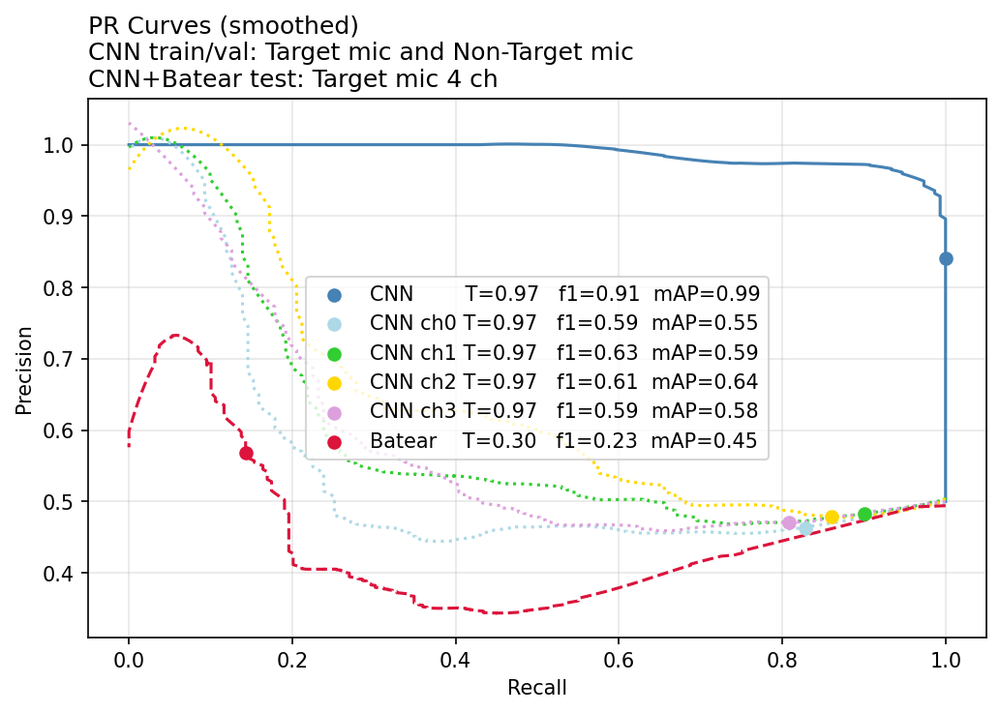

# drone-edge
Edge deployment model and pipeline. 

```
          ●
         /|\
        / | \
       ●  |  ●
          ●   
 
   Vertex + 3 base mics, synchronized and equally spaced.

  [4-mic] --> [fusion] -> [Spectrogram] --> [TFLite model] --> [threshold] --> drone / no-drone
                                                                    ^
                                                                    |
                                                           [level to threshold] 
       
```

Pipeline: sliding_windows → combine_channels → samples_to_spectrogram → [TFLite model] → is_drone

[level_to_threshold] can be called between detections — converts dial position (0-10) to a threshold value for is_drone, for easy field calibration.

## python

```
python/realtime_pipeline.py 
```
### Safe to change

```
DETECTION_THRESHOLD    # Drone / no-drone detection threshold, currently set at knob level = 6 which translates to 0.974, based on validation set knee of PR-curve.

N_FFT_HOPS             # Input buffer hop size in units of fft window size (which is set in model to 1024 samples), default hop = 4*1024 [samples] which translates to 256ms @ 16kHz. 

# Normalization parameters for mic channel fusion  
TARGET_RMS             # Target RMS level (relative to full scale)  
MAX_GAIN               # Gain multiplier  
COMP_THRESHOLD         # Threshold to begin compression   
```

### Do not change
The other parameters are fixed to the trained model. _See parameter descriptions in python code comments_.

### Functions

```
level_to_threshold     # set threshold for is_drone

sliding_windows        # extract segment of size N_SEGMENT for spectrogram [NOT INCLUDED, implement for target HW]

combine_channels       # supports 1 to N channels, tested on 1 and 4 channels

samples_to_spectrogram # configured for drone harmonics

is_drone               # based on DETECTION_THRESHOLD
```

## models

```
Trained models available in person :) 

Input shape  [ 1  193  39 1 ]

Output shape [ 1 ]
```

## Timing and Memory

Current model configurations translate to a latency of 20 * 1024 [samples] @16kHz = 1.28s.    
Model inference and spectrogram add 1.38ms per call (CPU profiling).  

TFLite model size 424KB.

TFLite conversion reduces model size by ~8x compared to the Pytorch float model <sup>*</sup>.

| Model                   | Processing time      | Memory      |
|-------------------------|----------------------|-------------|
| Batear                  | 0.85 ms              |   -         |
| CNN (pytorch float)     | 1.38 ms              | 3.35 MB     |
| CNN (pytorch quantized) | 1.37 ms              | 1.77 MB     |
| CNN (TFLite)            |  -                   |  424 KB     |

_CNN timing includes spectrogram computation.  Timing measured on CPU._  
_<sup>*</sup> Pytorch model memory estimated by torchinfo, includes model weights, input tensor, and forward-pass activations._

## classification results
Batear algorithm is used as benchmark [2].

PR curves show that CNN mAP 0.99 substantially outperforms Batear mAP 0.45 on the same 4-channel test set.
CNN f1-score is significantly higher than Batear, although Batear is evaluated at default threshold while the CNN threshold is tuned on validation set.
The fused 4-mic input to the CNN raises mAP by 0.40, from a mean of 0.59 across individual channels to 0.99.
CNN results may shift with additional application-specific target HW data and scenarios.



## References
[2] Batear by TN, founder of batear.io: https://github.com/batear-io/batear

